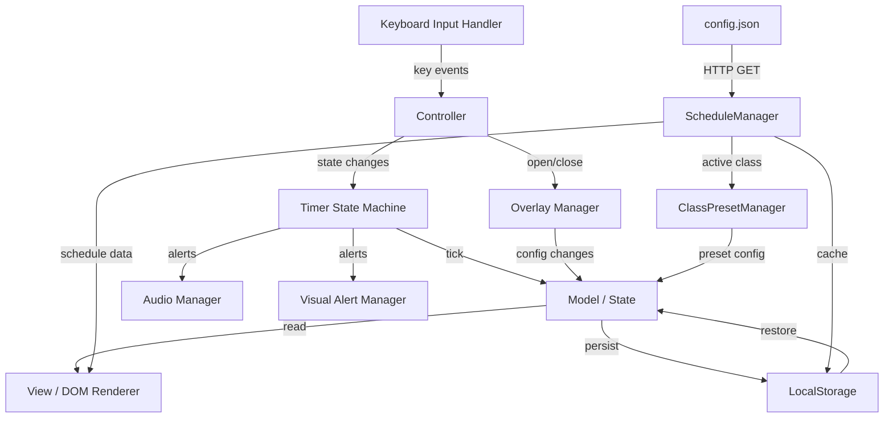
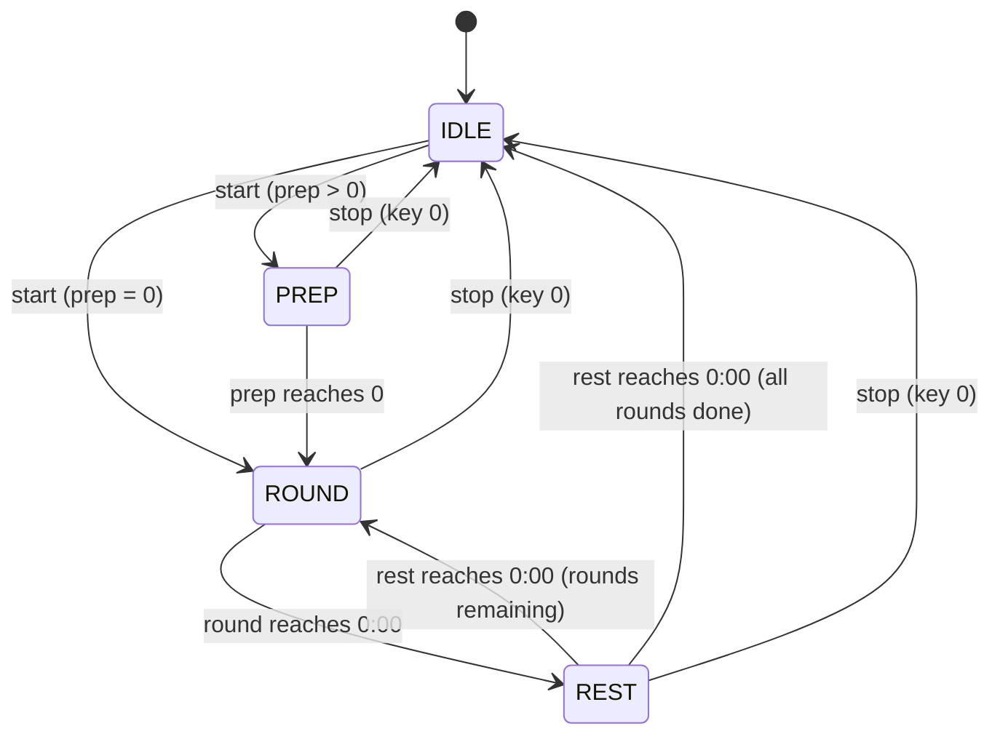
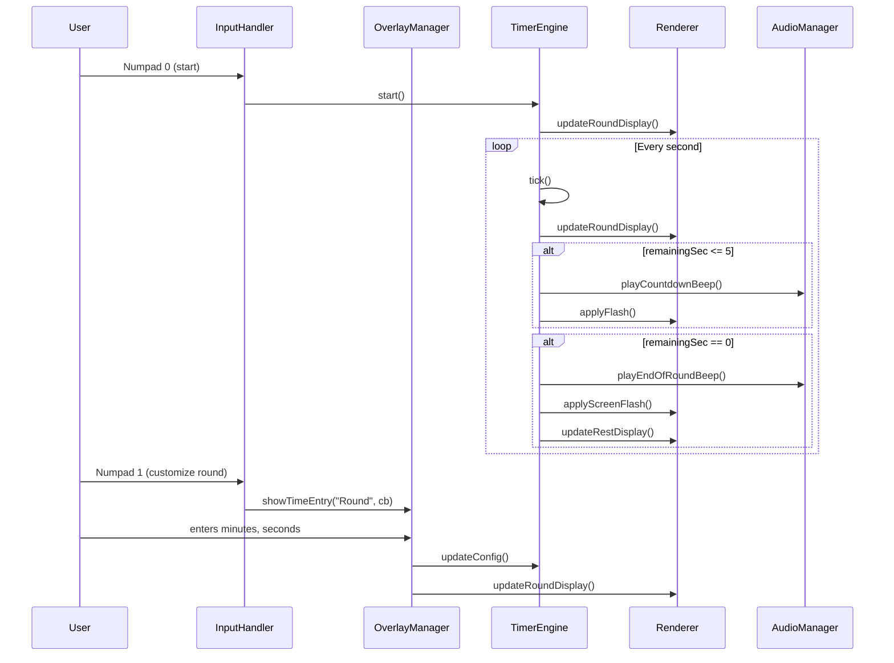
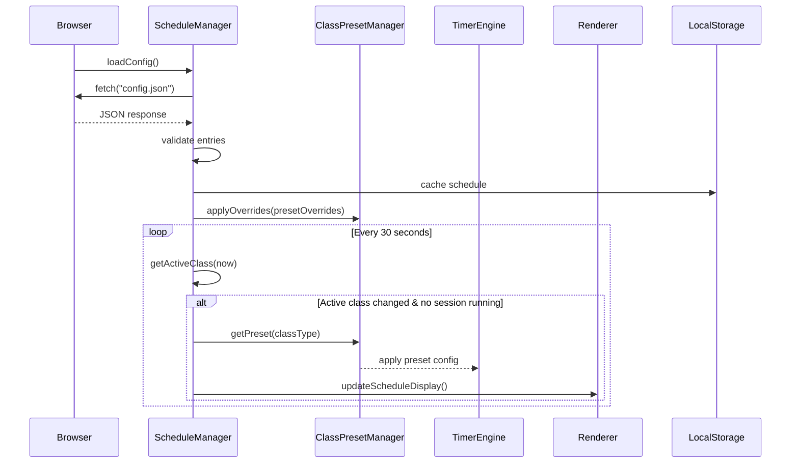

# Design Document: BJJ Timer

## Overview

The BJJ Timer is a single-page HTML application that provides round and rest countdown timers for Brazilian Jiu-Jitsu training sessions. It runs entirely in the browser with no backend, using vanilla HTML, CSS, and JavaScript. The application is designed for gym environments where a wireless numpad controls a large TV display.

The app manages a session lifecycle: optional prep countdown → round countdown → rest countdown → repeat. All state is driven by a single `setInterval` tick loop. Configuration is persisted to `localStorage` and restored on page load. Audio alerts use the Web Audio API (no external audio files). Visual alerts use CSS animations for flashing effects.

The app is also class-schedule-aware. It loads a weekly class schedule from a `config.json` file, determines the currently active class based on day and time, and automatically applies the correct timer presets (round duration, rest duration, rounds) for each class type. A Schedule Display section shows the current or next upcoming class. When no session is running and a new class becomes active, the timer presets update automatically.

### Key Design Decisions

- **Vanilla JS, single HTML file**: No build tools or frameworks. The entire app ships as one `index.html` with embedded `<style>` and `<script>` tags. This keeps deployment trivial (open the file in a browser).
- **Single tick loop**: One `setInterval` at 1-second intervals drives all countdowns and the wall clock. This avoids drift issues from multiple timers.
- **State machine for session lifecycle**: A finite state machine governs transitions between IDLE, PREP, ROUND, REST, and STOPPED states, making the cycling logic predictable and testable.
- **Web Audio API for beeps**: Generates tones programmatically, avoiding external file dependencies.
- **CSS custom properties for theming**: Dark theme colors defined as CSS variables for easy maintenance.
- **config.json for class schedule**: The weekly schedule is loaded from a co-located `config.json` file via HTTP GET. This keeps schedule management simple — edit one JSON file. The last successful load is cached in localStorage for offline resilience.
- **Automatic preset loading**: Each class type maps to a fixed Timer_Preset. When the active class changes and no session is running, presets apply automatically. This eliminates manual configuration for recurring classes.

## Architecture

The application follows a simple Model-View-Controller pattern within a single file:



### State Machine



States:
- **IDLE**: No timer running. Displays configured durations. Waiting for start.
- **PREP**: Prep countdown active. Displayed prominently. Transitions to ROUND when it hits 0.
- **ROUND**: Round countdown active. Transitions to REST at 0:00.
- **REST**: Rest countdown active. Transitions to ROUND (next round) or IDLE (session complete) at 0:00.

## Components and Interfaces

### 1. TimerState (Model)

Holds all application state as a plain object.

```javascript
/**
 * @typedef {Object} TimerConfig
 * @property {number} roundDurationSec - Round duration in seconds (default 300)
 * @property {number} restDurationSec  - Rest duration in seconds (default 60)
 * @property {number} numRounds        - Number of rounds, 0 = unlimited (default 0)
 * @property {number} prepDurationSec  - Prep countdown in seconds (default 0)
 */

/**
 * @typedef {'IDLE'|'PREP'|'ROUND'|'REST'} SessionPhase
 */

/**
 * @typedef {Object} TimerState
 * @property {TimerConfig} config
 * @property {SessionPhase} phase
 * @property {number} remainingSec       - Seconds remaining in current phase countdown
 * @property {number} currentRound       - Current round number (1-based)
 * @property {number|null} intervalId    - setInterval ID or null
 */
```

### 2. TimerEngine (Controller)

Manages the tick loop and state transitions.

```javascript
/** Creates a new TimerEngine.
 * @param {TimerState} state
 * @param {function} onTick - Called every second with updated state
 * @param {function} onPhaseChange - Called on state transitions
 */
class TimerEngine {
  start()          // Begin session (IDLE → PREP or ROUND)
  stop()           // Stop session (any → IDLE), reset counters
  tick()           // Decrement remainingSec, handle transitions
}
```

### 3. Renderer (View)

Updates the DOM based on current state. Pure function of state → DOM mutations.

```javascript
class Renderer {
  updateRoundDisplay(remainingSec, isActive)
  updateRestDisplay(remainingSec, isActive)
  updateClockDisplay()
  showPrepCountdown(remainingSec)
  hidePrepCountdown()
  applyFlash(element)       // CSS flash animation on timer element
  applyScreenFlash()        // Full-screen flash at 0:00
  updateRoundCounter(current, total)
  updateScheduleDisplay(activeClass, nextClass, errorMsg) // Update schedule section
}
```

### 4. AudioManager

Generates beep tones using the Web Audio API.

```javascript
class AudioManager {
  constructor()              // Creates AudioContext (lazy init on first user gesture)
  playCountdownBeep()        // Short beep for last 5 seconds
  playEndOfRoundBeep()       // Distinct tone for round end
  playEndOfRestBeep()        // Distinct tone for rest end
}
```

### 5. OverlayManager

Handles customization overlays and the advanced menu.

```javascript
class OverlayManager {
  showTimeEntry(label, callback)    // Two-step overlay: minutes then seconds
  showAdvancedMenu(config, callback) // Advanced settings overlay
  closeOverlay()                     // Dismiss active overlay
  isOpen()                           // Returns true if any overlay is active
}
```

### 6. InputHandler

Listens for keydown events and routes them.

```javascript
class InputHandler {
  constructor(engine, overlayManager, renderer)
  handleKeyDown(event)   // Routes numpad keys to appropriate action
}
```

### 7. StorageManager

Persists and restores configuration from localStorage.

```javascript
class StorageManager {
  static save(config)     // Serialize config to localStorage
  static load()           // Deserialize config from localStorage, return defaults if missing
}
```

### 8. ScheduleManager

Loads the class schedule from `config.json`, validates entries, determines the active class, and triggers preset loading on class transitions. Polls every 30 seconds.

```javascript
/**
 * @typedef {Object} ClassEntry
 * @property {string} dayOfWeek   - e.g. "Monday", "Tuesday"
 * @property {string} startTime   - HH:MM format
 * @property {string} endTime     - HH:MM format
 * @property {string} title       - Display name of the class
 * @property {'kids'|'adult_basics'|'adult_advanced'|'marathon_roll'|'open_mat'} classType
 */

class ScheduleManager {
  constructor(presetManager, storageManager, onActiveClassChange)
  async loadConfig()                  // Fetch config.json, validate, cache to localStorage
  validateEntry(entry)                // Returns { valid: boolean, errors: string[] }
  getActiveClass(now)                 // Returns ClassEntry or null
  getNextClass(now)                   // Returns ClassEntry or null
  startPolling()                      // Begin 30-second interval to check active class
  stopPolling()                       // Clear polling interval
}
```

### 9. ClassPresetManager

Maps class types to their default timer presets. Supports overrides loaded from config.json.

```javascript
/**
 * @typedef {Object} TimerPreset
 * @property {number} roundDurationSec
 * @property {number} restDurationSec
 * @property {number} numRounds        - 0 = unlimited
 */

class ClassPresetManager {
  constructor()
  getPreset(classType)                // Returns TimerPreset for the given classType
  applyOverrides(overrides)           // Merge config.json overrides into preset map
  getDefaultPresets()                 // Returns the full default preset map
}
```

### Component Interaction Flow



### Schedule Loading Flow



## Data Models

### Configuration Object (persisted to localStorage)

```json
{
  "roundDurationSec": 300,
  "restDurationSec": 60,
  "numRounds": 0,
  "prepDurationSec": 0
}
```

Key: `"bjj-timer-config"`

### IBJJF Competition Presets

| Preset Name | Round Duration | Rest Duration | Rounds |
|---|---|---|---|
| White Belt | 5:00 | 1:00 | 1 |
| Blue/Purple Belt | 6:00 | 1:00 | 1 |
| Brown/Black Belt | 8:00 | 1:00 | 1 |
| Kids (under 15) | 4:00 | 1:00 | 1 |

### Time Formatting

All timer displays use `MM:SS` format. The conversion functions:

```javascript
function formatTime(totalSeconds) {
  const mins = Math.floor(totalSeconds / 60);
  const secs = totalSeconds % 60;
  return `${String(mins).padStart(2, '0')}:${String(secs).padStart(2, '0')}`;
}

function parseTimeInput(minutes, seconds) {
  return (minutes * 60) + seconds;
}
```

### Wall Clock

Displayed in `HH:MM:SS` format using `Date` object, updated every tick.

### Class_Entry Schema

Each entry in the Class_Schedule array:

```json
{
  "dayOfWeek": "Monday",
  "startTime": "18:00",
  "endTime": "19:00",
  "title": "Kids BJJ",
  "classType": "kids"
}
```

Validation rules:
- `dayOfWeek`: Must be one of "Monday", "Tuesday", "Wednesday", "Thursday", "Friday", "Saturday", "Sunday" (case-sensitive)
- `startTime` / `endTime`: Must match `HH:MM` where HH is 00–23 and MM is 00–59. `startTime` must be before `endTime`.
- `title`: Non-empty string
- `classType`: Must be one of `kids`, `adult_basics`, `adult_advanced`, `marathon_roll`, `open_mat`

### config.json Schema

```json
{
  "schedule": [
    {
      "dayOfWeek": "Monday",
      "startTime": "17:00",
      "endTime": "18:00",
      "title": "Kids BJJ",
      "classType": "kids"
    },
    {
      "dayOfWeek": "Monday",
      "startTime": "18:30",
      "endTime": "20:00",
      "title": "Adult Basics",
      "classType": "adult_basics"
    }
  ],
  "presetOverrides": {
    "kids": { "roundDurationSec": 180, "restDurationSec": 20 },
    "marathon_roll": { "roundDurationSec": 600, "restDurationSec": 45 }
  }
}
```

- `schedule` (required): Array of Class_Entry objects
- `presetOverrides` (optional): Object keyed by classType, with partial Timer_Preset fields to override defaults

### Timer_Preset Defaults by Class Type

| Class Type | Round Duration | Rest Duration | Rounds |
|---|---|---|---|
| kids | 3:00 (180s) | 0:30 (30s) | 0 (unlimited) |
| adult_basics | 5:00 (300s) | 1:00 (60s) | 0 (unlimited) |
| adult_advanced | 6:00 (360s) | 1:00 (60s) | 0 (unlimited) |
| marathon_roll | 10:00 (600s) | 0:30 (30s) | 0 (unlimited) |
| open_mat | 5:00 (300s) | 1:00 (60s) | 0 (unlimited) |

### Schedule State (persisted to localStorage)

```json
{
  "schedule": [ /* Class_Entry[] */ ],
  "presetOverrides": { /* optional overrides */ },
  "lastLoaded": "2024-01-15T10:30:00Z"
}
```

Key: `"bjj-timer-schedule"`


## Correctness Properties

*A property is a characteristic or behavior that should hold true across all valid executions of a system — essentially, a formal statement about what the system should do. Properties serve as the bridge between human-readable specifications and machine-verifiable correctness guarantees.*

### Property 1: Time formatting produces valid output

*For any* non-negative integer `totalSeconds` (0 ≤ totalSeconds ≤ 5999), `formatTime(totalSeconds)` should produce a string matching the pattern `MM:SS` where MM is zero-padded minutes and SS is zero-padded seconds, and parsing the result back should yield the original value.

**Validates: Requirements 1.1, 2.1, 3.1**

### Property 2: Tick decrements remaining time by one

*For any* timer state where `phase` is PREP, ROUND, or REST and `remainingSec > 0`, calling `tick()` should produce a new state where `remainingSec` is exactly one less than before, and `phase` remains unchanged.

**Validates: Requirements 2.3, 3.3, 13.2**

### Property 3: State machine transitions follow defined rules

*For any* valid timer state, the transition produced by `tick()` when `remainingSec` reaches 0 must follow these rules:
- PREP → ROUND (with remainingSec set to roundDurationSec, currentRound = 1)
- ROUND → REST (with remainingSec set to restDurationSec)
- REST → ROUND (if rounds remain, with remainingSec set to roundDurationSec, currentRound incremented)
- REST → IDLE (if numRounds > 0 and currentRound equals numRounds)

**Validates: Requirements 4.1, 4.2, 5.1, 5.2, 5.4, 13.1, 13.3**

### Property 4: Stop resets state to configured values

*For any* timer state in a non-IDLE phase and any valid config, calling `stop()` should produce a state where `phase` is IDLE, `remainingSec` equals `config.roundDurationSec`, and `currentRound` is reset to 0.

**Validates: Requirements 4.3**

### Property 5: Time input parsing round-trip

*For any* valid minutes (0–99) and seconds (0–59), `parseTimeInput(minutes, seconds)` should equal `minutes * 60 + seconds`, and `formatTime(parseTimeInput(minutes, seconds))` should display those same minutes and seconds.

**Validates: Requirements 6.3, 7.3**

### Property 6: Configuration serialization round-trip

*For any* valid `TimerConfig` object, saving it to localStorage via `StorageManager.save(config)` and then loading it via `StorageManager.load()` should produce an object deeply equal to the original config.

**Validates: Requirements 6.4, 7.4, 8.3, 12.6**

### Property 7: Input validation rejects non-numeric strings

*For any* string that contains at least one non-digit character, the overlay input validation function should return false (reject the input). *For any* string composed entirely of digit characters, the validation function should return true (accept the input).

**Validates: Requirements 6.5, 7.5**

### Property 8: Alert conditions match remaining time thresholds

*For any* timer state where `phase` is ROUND or REST: if `remainingSec` is between 1 and 5 (inclusive), the tick should signal a countdown alert. If `remainingSec` is 0, the tick should signal an end-of-phase alert. If `remainingSec` is greater than 5, no alert should be signaled.

**Validates: Requirements 9.1, 9.2, 9.3, 9.4, 10.1, 10.2, 10.3, 10.4**

### Property 9: Competition preset application sets correct values

*For any* competition preset from the defined preset list, applying that preset to the config should set `roundDurationSec`, `restDurationSec`, and `numRounds` to the exact values defined in the preset, and no other config fields should be modified.

**Validates: Requirements 12.5**

### Property 10: Only recognized numpad keys trigger actions

*For any* keyboard event, if the key code does not correspond to a recognized numpad key (0, 1, 2, *), the timer state and UI should remain completely unchanged. If the key code corresponds to a recognized numpad key, the appropriate action should be dispatched.

**Validates: Requirements 15.1, 15.4**

### Property 11: Overlay captures numpad input when open

*For any* state where an overlay (Customization_Overlay or Advanced_Menu) is open, numpad key presses should be routed to the overlay's input handler and should not trigger timer start/stop or other main controls.

**Validates: Requirements 15.3**

### Property 12: Class_Entry validation accepts valid and rejects invalid entries

*For any* object, `validateEntry` should return valid if and only if the object contains all required fields (`dayOfWeek`, `startTime`, `endTime`, `title`, `classType`) with correct types and values (dayOfWeek is a valid day name, startTime/endTime match HH:MM with valid ranges, classType is one of the five defined types, title is non-empty). For any object missing a required field or containing an invalid value, `validateEntry` should return invalid with a descriptive error message.

**Validates: Requirements 16.2, 16.3**

### Property 13: Active class detection returns correct class for current time

*For any* valid Class_Schedule and any date/time that falls within a Class_Entry's dayOfWeek and startTime–endTime range, `getActiveClass(now)` should return that Class_Entry. For any date/time that does not fall within any Class_Entry's range, `getActiveClass(now)` should return null.

**Validates: Requirements 17.2**

### Property 14: Next class detection returns chronologically next class

*For any* valid Class_Schedule and any date/time where no Active_Class exists, `getNextClass(now)` should return the Class_Entry whose dayOfWeek and startTime is the earliest future occurrence relative to `now`. If the schedule is empty, `getNextClass(now)` should return null.

**Validates: Requirements 17.3**

### Property 15: Timer preset mapping returns correct defaults for each class type

*For any* classType in the set {kids, adult_basics, adult_advanced, marathon_roll, open_mat}, `getPreset(classType)` should return a TimerPreset with the exact roundDurationSec, restDurationSec, and numRounds values defined in the preset table. When an Active_Class is detected, the loaded preset config should match `getPreset(activeClass.classType)`.

**Validates: Requirements 18.1, 18.2, 18.3, 18.4, 18.5, 19.1, 19.2**

### Property 16: Preset loading is deferred during active session

*For any* timer state where `phase` is not IDLE (a session is running) and the Active_Class changes, the timer config should remain unchanged until the session is stopped. *For any* timer state where `phase` is IDLE and the Active_Class changes, the timer config should be updated immediately to match the new class type's preset.

**Validates: Requirements 19.3, 19.4**

### Property 17: Schedule display renders correct information

*For any* Active_Class, the Schedule_Display render output should contain the class title, classType, and remaining time. *For any* state with no Active_Class but a non-empty schedule, the render output should contain the next class's title, classType, day, and start time.

**Validates: Requirements 17.4, 20.1, 20.2**

### Property 18: Schedule persistence round-trip

*For any* valid Class_Schedule array, saving it to localStorage and then loading it back should produce an array deeply equal to the original schedule.

**Validates: Requirements 21.4**

### Property 19: Preset overrides take precedence over defaults

*For any* classType and any partial TimerPreset override, after calling `applyOverrides`, `getPreset(classType)` should return a TimerPreset where overridden fields match the override values and non-overridden fields retain their defaults.

**Validates: Requirements 21.5**

### Property 20: Invalid config.json triggers graceful fallback

*For any* string that is not valid JSON or does not contain a "schedule" property with an array value, the config loading function should return an error result, and the app should continue operating without a schedule (schedule display shows error message, timer functions normally with manual config).

**Validates: Requirements 21.3**

## Error Handling

### Input Validation Errors

- **Non-numeric overlay input**: When a user enters a non-numeric value in the Customization_Overlay, display an inline error message ("Please enter a number") and re-prompt. Do not close the overlay or change config.
- **Out-of-range values**: Seconds values ≥ 60 should be clamped or rejected with a message. Minutes values should be capped at a reasonable maximum (e.g., 99).
- **Empty input**: Treat empty string as invalid, same as non-numeric.

### LocalStorage Errors

- **Corrupted data**: If `JSON.parse` fails on stored config, fall back to default values (round: 300s, rest: 60s, numRounds: 0, prepDurationSec: 0). Log a warning to console.
- **Storage unavailable**: If localStorage is not available (private browsing, storage full), catch the exception and continue with in-memory config only. The app remains fully functional but won't persist across reloads.

### Audio Context Errors

- **AudioContext blocked**: Browsers require a user gesture before creating an AudioContext. The AudioManager lazily initializes on the first numpad key press. If creation fails, catch the error and disable audio alerts silently — visual alerts still function.
- **Audio playback failure**: Wrap all `oscillator.start()` calls in try/catch. On failure, log to console and continue without sound.

### State Machine Guards

- **Double-start prevention**: If `start()` is called while already in a non-IDLE phase, ignore the call (the 0 key toggles, so this maps to stop instead).
- **Tick after stop**: If `tick()` fires after `stop()` has cleared the interval, check phase === IDLE and return early.
- **Zero-duration config**: If roundDurationSec or restDurationSec is 0, treat as 1 second minimum to prevent infinite loops in the state machine.

### Config.json Loading Errors

- **Fetch failure (network error, 404)**: If `fetch("config.json")` rejects or returns a non-OK status, display "Could not load schedule" in the Schedule_Display section. Fall back to localStorage-cached schedule if available, otherwise operate without a schedule.
- **Invalid JSON**: If `JSON.parse` fails on the response body, display "Invalid config.json format" in Schedule_Display. Fall back to cached schedule or no schedule.
- **Missing schedule property**: If the parsed JSON does not contain a `schedule` array, display "config.json missing schedule data" in Schedule_Display. Fall back as above.
- **Invalid Class_Entry**: If a Class_Entry fails validation, log the specific validation errors to `console.warn` (e.g., "Class entry 3: invalid classType 'beginner'"). Skip the invalid entry and continue processing remaining entries.
- **Empty schedule after validation**: If all entries are invalid, treat as empty schedule — display "No classes scheduled".

### Schedule Transition Guards

- **Preset loading during session**: If a session is running (phase !== IDLE) when the active class changes, store the pending class type but do not apply the preset. Apply it when the session stops.
- **Overlapping class entries**: If multiple Class_Entry objects overlap for the same day/time, use the first matching entry in array order. Log a warning to console.
- **Invalid time ranges**: If a Class_Entry has startTime >= endTime, reject it during validation (classes spanning midnight are not supported).

## Testing Strategy

### Testing Framework

- **Unit tests**: Use a lightweight test runner that works in the browser or Node.js (e.g., Vitest or Jest with jsdom).
- **Property-based tests**: Use **fast-check** (`fc`) for JavaScript property-based testing. Each property test runs a minimum of 100 iterations.

### Unit Tests

Unit tests cover specific examples, edge cases, and integration points:

- `formatTime(0)` returns `"00:00"`, `formatTime(300)` returns `"05:00"`, `formatTime(5999)` returns `"99:59"`
- Default config values are correct (round: 300, rest: 60, numRounds: 0, prep: 0)
- Help menu contains all four required entries
- Pressing key 1 in IDLE opens the round customization overlay
- Pressing key * opens the advanced menu
- Each IBJJF preset has the correct specific values
- Corrupted localStorage falls back to defaults
- Overlay rejects empty string input
- Each class type preset has the correct specific values (kids: 180/30/0, adult_basics: 300/60/0, adult_advanced: 360/60/0, marathon_roll: 600/30/0, open_mat: 300/60/0)
- Empty schedule displays "No classes scheduled"
- Multiple classes on the same day are all accepted
- config.json with missing "schedule" property triggers fallback
- config.json fetch 404 triggers fallback with error message

### Property-Based Tests

Each property test references its design document property and uses fast-check for input generation.

- **Test 1** — Feature: bjj-timer, Property 1: Time formatting produces valid output
  Generate random integers 0–5999, verify formatTime output matches MM:SS regex and round-trips correctly.

- **Test 2** — Feature: bjj-timer, Property 2: Tick decrements remaining time by one
  Generate random phase (PREP/ROUND/REST) and remainingSec (1–5999), verify tick produces remainingSec - 1 with same phase.

- **Test 3** — Feature: bjj-timer, Property 3: State machine transitions follow defined rules
  Generate random valid configs and states at remainingSec=0, verify the resulting phase and remainingSec match the state machine diagram.

- **Test 4** — Feature: bjj-timer, Property 4: Stop resets state to configured values
  Generate random non-IDLE states and configs, verify stop() produces IDLE with correct remainingSec.

- **Test 5** — Feature: bjj-timer, Property 5: Time input parsing round-trip
  Generate random minutes (0–99) and seconds (0–59), verify parseTimeInput then formatTime round-trips.

- **Test 6** — Feature: bjj-timer, Property 6: Configuration serialization round-trip
  Generate random valid TimerConfig objects, verify save then load produces deep-equal result.

- **Test 7** — Feature: bjj-timer, Property 7: Input validation rejects non-numeric strings
  Generate random strings with non-digit characters, verify rejection. Generate digit-only strings, verify acceptance.

- **Test 8** — Feature: bjj-timer, Property 8: Alert conditions match remaining time thresholds
  Generate random phase (ROUND/REST) and remainingSec (0–600), verify alert signals match the threshold rules.

- **Test 9** — Feature: bjj-timer, Property 9: Competition preset application sets correct values
  For each preset in the list, verify applying it sets the exact expected config values.

- **Test 10** — Feature: bjj-timer, Property 10: Only recognized numpad keys trigger actions
  Generate random key codes, verify that unrecognized keys leave state unchanged and recognized keys dispatch actions.

- **Test 11** — Feature: bjj-timer, Property 11: Overlay captures numpad input when open
  Generate random numpad keys while overlay is open, verify none trigger main timer controls.

- **Test 12** — Feature: bjj-timer, Property 12: Class_Entry validation accepts valid and rejects invalid entries
  Generate random objects with valid and invalid field combinations, verify validateEntry correctly accepts/rejects and provides descriptive errors for invalid entries.

- **Test 13** — Feature: bjj-timer, Property 13: Active class detection returns correct class for current time
  Generate random valid schedules and random date/times within class ranges, verify getActiveClass returns the correct class. Generate times outside all ranges, verify null.

- **Test 14** — Feature: bjj-timer, Property 14: Next class detection returns chronologically next class
  Generate random valid schedules and random date/times where no class is active, verify getNextClass returns the chronologically nearest future class.

- **Test 15** — Feature: bjj-timer, Property 15: Timer preset mapping returns correct defaults for each class type
  Generate random classType values from the valid set, verify getPreset returns the exact defined default values. Verify that when an active class is detected, the loaded config matches the preset.

- **Test 16** — Feature: bjj-timer, Property 16: Preset loading is deferred during active session
  Generate random non-IDLE states with class changes, verify config is unchanged. Generate IDLE states with class changes, verify config is updated to match the new preset.

- **Test 17** — Feature: bjj-timer, Property 17: Schedule display renders correct information
  Generate random active classes, verify render output contains title, classType, and remaining time. Generate states with no active class, verify render output contains next class info.

- **Test 18** — Feature: bjj-timer, Property 18: Schedule persistence round-trip
  Generate random valid Class_Schedule arrays, save to localStorage, load back, verify deep equality.

- **Test 19** — Feature: bjj-timer, Property 19: Preset overrides take precedence over defaults
  Generate random classTypes and random partial TimerPreset overrides, apply overrides, verify getPreset returns overridden values for specified fields and defaults for others.

- **Test 20** — Feature: bjj-timer, Property 20: Invalid config.json triggers graceful fallback
  Generate random invalid JSON strings and objects missing the "schedule" property, verify the config loader returns an error result and the app state remains functional without a schedule.

### Test Configuration

- Property tests: minimum 100 iterations per test via `fc.assert(property, { numRuns: 100 })`
- Each property test file includes a comment tag: `// Feature: bjj-timer, Property N: <title>`
- Tests run via `npx vitest --run` (single execution, no watch mode)
- Schedule-related tests should mock `Date` and `fetch` to control time and config.json responses
